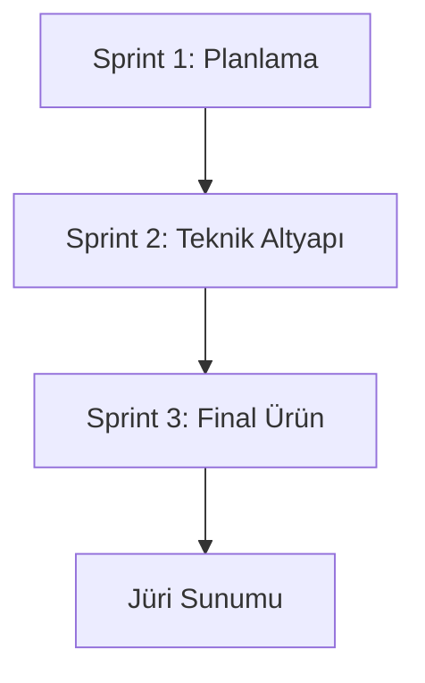
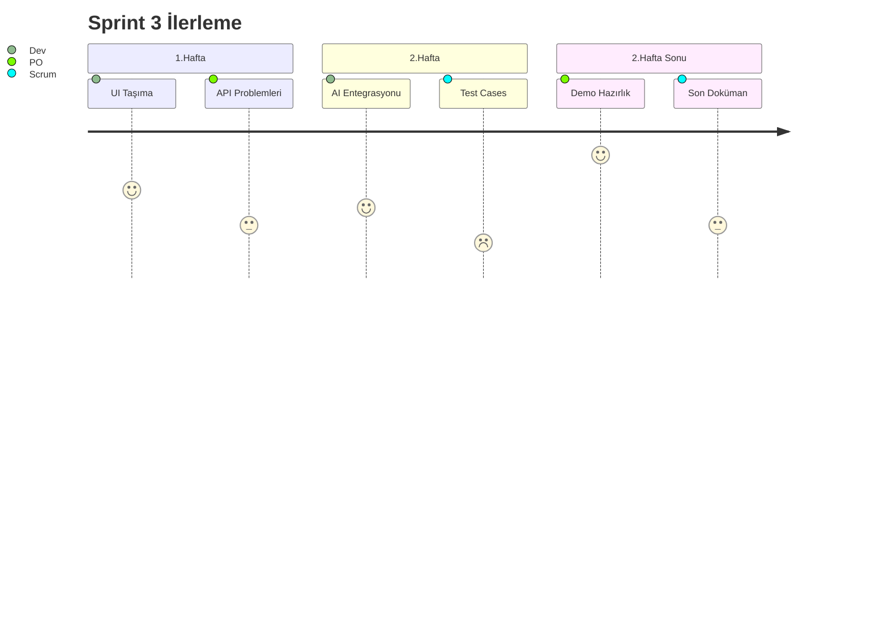
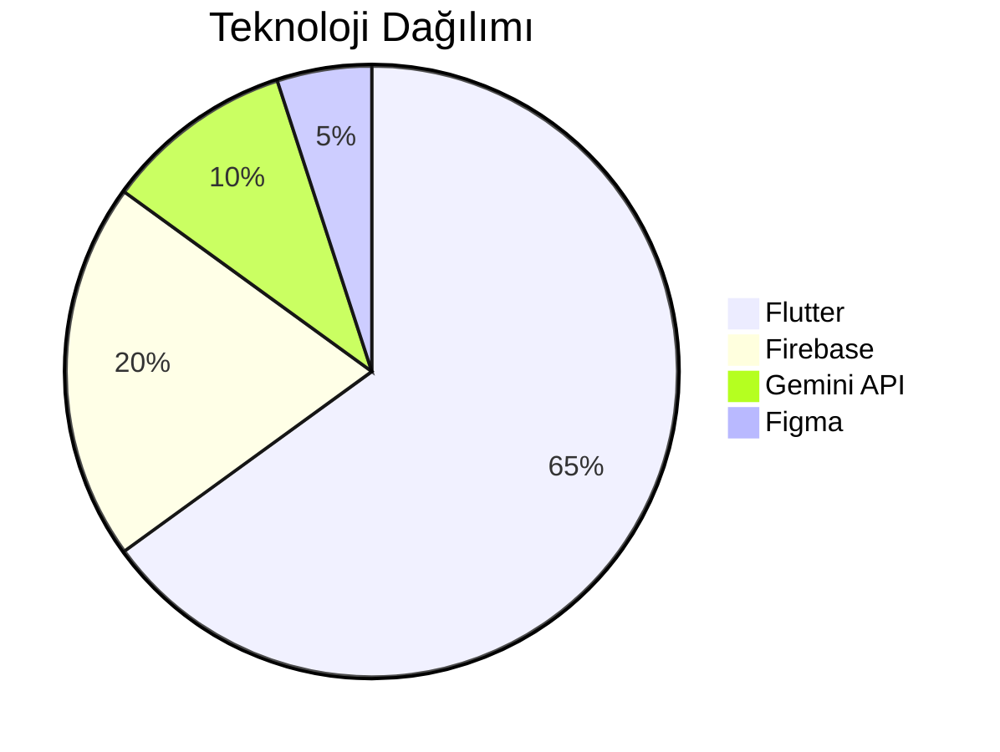
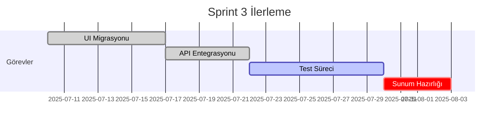
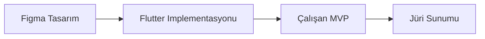
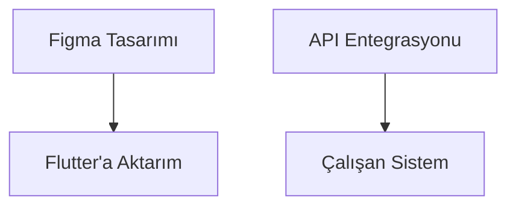
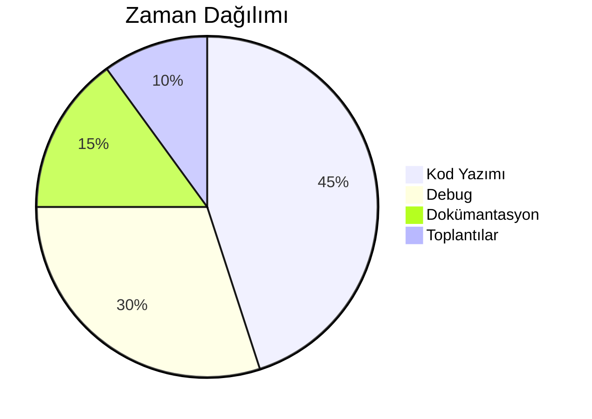
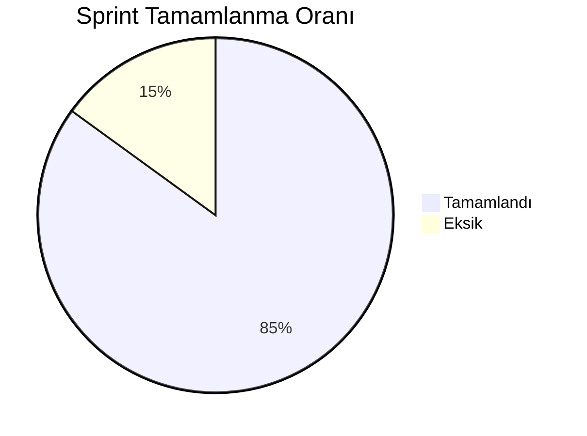

Takım İsmi
-
Laters

Ürün İle İlgili Bilgiler
-
Takım Elemanları
-
1. Serhat Yazıcı - Scrum Master
2. Ege Çağın Tepe - Product Owner
3. Furkan Akalp - Developer

Ürün İsmi
-
🧠 Medakai — Akıllı İlaç Rehberi ve Asistanı

Takım Logosu
-


🩺 Ürün Açıklaması
-
Medakai, ilaç kullanımı sırasında hastaların karşılaştığı kafa karışıklıklarını ve bilgi eksikliğini yapay zeka ile gideren bir sağlık teknolojisi çözümüdür. Kullanıcılara ilaçlarla ilgili yan etkiler, kullanım dozajları, kontrendikasyonlar ve etkileşimler hakkında özet bilgiler sunarken, ilaç saatlerini hatırlatma ve olası yan etkilerde önlem alma konusunda aktif destek sağlar.

İlaç prospektüslerinin genellikle okunmaması veya anlaşılamaması, yanlış doz kullanımı ve yan etki yönetiminde yetersizlik gibi ciddi sonuçlara yol açabilir. Medakai, kullanıcı dostu arayüzü ve yapay zeka destekli bilgi sistemi sayesinde bu sorunlara etkili çözümler sunar. Aynı zamanda kullanıcıların sağlıkla ilgili farkındalığını artırmayı hedefler.

________________________________________
📖 Uygulama Hikayesi
-
Yapılan saha araştırmalarında, hastaların ilaç kullanımı sırasında prospektüsleri çoğunlukla okumadığı, saatinde ilaç almayı unuttuğu ve yan etkilerle karşılaştığında nasıl tepki vereceğini bilemediği tespit edilmiştir.
Özellikle yaşlı bireyler, kronik hastalık takibi yapanlar ve çoklu ilaç kullananlar için bu durum hayati önem taşımaktadır.

Bu ihtiyaçtan yola çıkarak geliştirilen Medakai, sadece bir “ilaç bilgi kütüphanesi” değil, aynı zamanda kişisel bir ilaç asistanıdır. Kendi ilaç programını yöneten bireylerin, yapay zekaya soru sorarak yan etkiler konusunda bilgi alması, ilaç saatlerini takip etmesi ve dijital prospektüs özetlerine ulaşması amaçlanmıştır.

________________________________________
🔧 Ürün Özellikleri (MVP)
-
•	🔍 İlaç Bilgisi Sorgulama: Kullanıcı, ilaç ismini yazarak kullanım amacı, dozaj, yan etkiler ve etkileşimler hakkında özet bilgi alır.

•	🧠 Yan Etki Danışmanı (AI destekli): “Bu ilacı içtim, başım ağrıyor. Normal mi?” gibi sorulara LLM (Gemini) destekli cevap sistemiyle yanıt verir.

•	⏰ İlaç Hatırlatıcı: Günlük ilaç saatlerini belirleme ve uygulama üzerinden bildirim alma.

•	📄 Prospektüs Özeti: İlaçların uzun prospektüs metinlerini kısa ve sade paragraflar halinde sunar.

•	🛡️ Riskli Etkileşim Uyarıları (Geliştirilecek): Aynı anda kullanılan ilaçların etkileşim potansiyelini kullanıcıya sunar.

________________________________________
🎯 Hedef Kitle
-
•	Kronik hastalığı olan bireyler (ör. diyabet, hipertansiyon hastaları)

•	Yaşlı bireyler ve bakıma muhtaç hastalar

•	Çoklu ilaç kullanan kullanıcılar

•	Ebeveynler (çocuklarının ilaç takibini yapmak isteyenler)

•	Sağlık okuryazarlığı düşük olan bireyler

🧰 Kullanılan Teknolojiler (Sprint 1 Planı)
-
•	Frontend: Streamlit (hızlı prototipleme için)

•	AI Platformu: Gemini Pro API (LLM ile doğal dil yanıtları)

•	Veri Tabanı (ilerleyen sprintlerde): SQLite veya Firebase

•	Bildirim Sistemi: Local Time Alerts (Streamlit içinde)

•	Versiyonlama: GitHub + README + Sprint dökümanları

________________________________________

🪜 Sprint 1 Hedefleri
-

•	Proje vizyonunun netleştirilmesi

•	Kullanıcı senaryolarının yazılması

•	Prototip arayüz taslağı (Streamlit veya Figma)

•	Prompt sisteminin ve örnek veri girişlerinin hazırlanması

•	Ürün isim ve logo çalışmasının tamamlanması

•	GitHub repo oluşturulması ve temel klasör yapısı kurulumu

•	MVP kapsamının belirlenmesi ve backlog dosyasının oluşturulması

________________________________________

💡 Geliştirme Sonrası Planlar
-
•	Genişletilmiş ilaç veritabanı entegrasyonu (Türk İlaç ve Tıbbi Cihaz Kurumu verileriyle)

•	Mobil uygulama dönüşümü (.apk)

•	Sesli asistan entegrasyonu (Google STT)

•	Yan etki istatistikleri ve kullanıcı topluluğu oluşturma

•	Acil durum butonu ile sağlık danışmanına yönlendirme sistemi

________________________________________

📝 Jüriye Not

Bu ürün, yalnızca bir teknik uygulama değil, aynı zamanda kamu sağlığına katkı sağlayacak sosyal etkisi yüksek bir dijital çözümdür. Sprint 1 sonunda teknik prototipimiz kısıtlı fonksiyonlarla sunulsa da, Medakai’nin büyüme ve ölçeklenme potansiyeli yüksektir. Son sprintlerde canlı demo, LLM cevap motoru ve test veri entegrasyonları tamamlanacaktır.

Backlog URL : https://trello.com/b/O9WYqpNQ/bootcamp-190-medikai

📝 Sprint 1
-

Medakai projesi, ilaç kullanıcılarına yönelik yapay zeka destekli kişisel bir sağlık asistanı olarak planlandı. Bu sprintin temel amacı, ürünün vizyonunu netleştirmek, teknik çerçevesini çizmek ve sprint sürecini başlatacak planlamaları tamamlamaktı.

Sprint 1 kapsamında aşağıdaki adımlar gerçekleştirilmiştir:

1. Proje adı ve vizyonu netleştirildi.

2. Takım içi görev dağılımı yapıldı ve roller belirlendi.


(Detaylı Görev Dağılımı İçin Trello Sayfamıza Bakınız)

3. Ürün fikrinin hedef kitlesi ve kullanım senaryoları belirlendi.

4. Minimum Viable Product (MVP) kapsamı çıkarıldı.

5. Proje dosya yapısı oluşturuldu, GitHub reposu açıldı.

7. Ürün logosu tasarlandı ve uygulamaya entegre edilmesi planlandı.


🎯 Sprint Planlaması
-

Sprint içinde tamamlanması tahmin edilen puan: 100 Puan

Puan tamamlama mantığı:

Toplam 300 puanlık product backlog hedefi belirlendi. 3 sprint’e bölündüğünde, Sprint 1 için 100 puanlık görev planlandı. Bu puanlama, kullanıcı araştırmaları, tasarım üretimi, teknik planlama ve AI modülü hazırlığına göre yapılandırıldı.

| Kart Başlığı                           | Açıklama                               | Tahmini Puan (Story Point) |
| -------------------------------------- | -------------------------------------- | -------------------------- |
| Proje adı ve vizyonunun belirlenmesi   | Medakai ismi, logo, slogan             | 10                         |
| Kullanıcı senaryolarının çıkarılması   | Hedef kitleye uygun kullanım örnekleri | 15                         |
| MVP kapsamının belirlenmesi            | Minimum özelliklerin netleştirilmesi   | 10                         |
| GitHub oluşturulması ve README şablonu | Temel repo yapısı                      | 10                         |
| UI ekran tasarımı yapılması            | Ekran tasarımı                         | 25                         |
| AI senaryolarının planlanması          | Prompt örnekleri ve cevaplar           | 15                         |
| Proje dosya yapısının planlanması      | Klasör düzeni, requirements vs.        | 10                         |
| Trello kurulumu ve görev dağılımı      | Sprint 1 panosu ve roller              | 5                          |

Backlog URL : https://trello.com/b/O9WYqpNQ/bootcamp-190-medikai

🗓️ Daily Scrum
-

Sprint süresince ekip üyeleriyle günlük iletişim, WhatsApp grubunda yazılı olarak sağlandı.

Toplantılar Product Owner liderliğinde ilerledi.


🎨 UI / UX Tasarımları
-
Bu sprintin bir diğer hedefi, ürünün temel arayüzünü oluşturmaktı. Kullanıcının ilaç adı girmesi ve sistemin ilgili bilgiyi ya da yan etki yorumunu göstermesi üzerine bir ekran akışı planlandı.

Sprint 1’de, koddan bağımsız şekilde hızlı prototipleme imkânı veren bir low-code tasarım aracı kullanılarak aşağıdaki ekranlar üretildi:

Hoş Geldin Ekranı


Profil Kısmı


Hızlı Erişim Ekranı


Olası Bir Sağlık Güncellemesi Kayıt Etme Ekranı


Arama Ekranı


Seçilen İlaçla İlgili Detaylar Kısmı


Yapay Zeka İle Sohbet Kısmı 


Yapay Zeka İle Sohbet


Sık Kullanılan İlaçlarla İlgili Hatırlatıcı Kurma Ekranı


🛠️ Teknik Altyapı Planlaması
-
Geliştirme ortamı olarak PyCharm + Streamlit tercih edildi.

Kullanıcı arayüzü için Streamlit’in mobil uyumlu yapısından faydalanılacak.

Backend ihtiyaçları ilerleyen sprintlerde Gemini API ile desteklenecek.

Sonraki sprinte kadar gereken Python kütüphaneleri listelenecek ve requirements.txt dosyasına yazılacak.

🧠 AI Planlaması
-
LLM destekli “yan etki danışmanı” modülünün prompt yapısı belirlendi.

Örnek kullanıcı girişi ve model yanıtı aşağıda gösterilmiştir:

Kullanıcı: “Augmentin aldım ama midem bulandı, ne yapmalıyım?”
AI Prompt: “Kullanıcının ilaç ve semptom bilgisi üzerinden medikal uyarı ver. Gerekiyorsa doktora başvurmasını öner.”
Cevap: “Mide bulantısı Augmentin'in bilinen yan etkilerindendir. Eğer belirtiler şiddetlenirse doktorunuza başvurunuz.”

📊 Sprint Board
-


https://trello.com/b/O9WYqpNQ/bootcamp-190-medikai


🧾 Sprint Review
-
Sprint 1 süresince takımda katılım eksikliği yaşanmıştır. Bu nedenle görevlerin büyük bölümü Product Owner ve Scrum Master tarafından yapılmıştır. Buna rağmen, ürün fikrinin netleştirilmesi, görsel tasarım, teknik planlama ve dokümantasyon başarıyla tamamlanmıştır.

🔁 Sprint Retrospective
-
Teknik altyapı Sprint 2’ye hazır hale getirildi.

Katılım göstermeyen üyelerin yeniden görevlendirilmesi ve bildirilmesi planlanıyor.

Sprintte ilk çalışan demo hedefleniyor (Streamlit tabanlı, temel AI cevabı).

Eğer katkı alınamazsa, dış mentorlardan destek istenerek proje sürdürülecek.

📌 Not
Bu sprint kod yazımı açısından sınırlı geçmiş olsa da, planlama ve strateji açısından güçlü temeller atılmıştır. Takım dinamiğinin güçlendirilmesi ile sonraki sprintlerde fonksiyonel çıktılar elde edilmesi hedeflenmektedir.


---

# 💡 Sprint 2

---

## 🎯 Sprint Hedefi

Bu sprintin temel amacı, sağlık verilerinin yapay zekâ destekli analizine yönelik oluşturulacak uygulamanın temel veri akışını ve dış servislerle olan bağlantısını kurmak, kullanıcıya hatırlatma bildirimleri sağlayan işlevsel bir prototip oluşturmaktı.

Bu kapsamda aşağıdaki hedefler belirlenmiştir:

* OpenFDA veri setiyle API bağlantısı kurulması
* İlaçlara ait temel verilerin çekilmesi ve yorumlanması
* Türkçeleştirme işlemlerinin başlatılması
* Hatırlatma sisteminin temelinin atılması
* Mobil arayüz için ilk UI fikirlerinin ve temel mockup taslaklarının hazırlanması


## 🧩 1. **Gerçekleştirilen İlk Adımlar**

Sprint başında alınan kararlar ve oluşturulan altyapı hakkında genel bilgi.

 * Sprint 2 başlangıcında bir önceki sprint değerlendirilmiş, eksikler belirlenmiş ve buna göre bir geliştirme planı çıkarılmıştır.
 * Takım üyeleri arasında yeni görev dağılımı yapılmıştır.
 * OpenFDA API ile entegrasyon süreci başlatılmıştır.
 * Reminder (hatırlatma) sistemi temel düzeyde planlanmış ve test edilmiştir.

---

## 📋 Sprint Board – Project Management

📌 **Ek:** Trello board ekran görüntüsü aşağıda yer almaktadır.


---

## ⚙️ 5. **Teknik Altyapı – Alt Depo Planlaması**

> Hangi diller, hangi sistemler, nasıl entegrasyon?

* Backend: Python (FastAPI ile REST API geliştirme)
* Veritabanı: SQLite (başlangıç)
* Frontend: Flutter (ileride)
* OpenFDA API entegrasyonu: `requests` ile veri çekme
* Reminder sistemi: `schedule` veya `apscheduler` ile zamanlayıcı
* Deployment: İlk aşamada lokal, ileride Streamlit Cloud


## 📊 Burn Down Chart 

```plaintext
Task Completion Rate: 67 %
Remaining Tasks: 5
Completed: 10
```

---

## 📷 App Screenshot

API Entegrasyonu Sonrası İlk Deneme

https://github.com/user-attachments/assets/5133eb17-9beb-4a51-8581-8bbf2fa3bc6a

İlk Test Fotoğrafları:


---

## 🧠 **Yapay Zekâ Planlaması**

> Hedef model, veriseti, etiketleme planı

* Kullanılacak yöntem: Basit sınıflandırıcı (Random Forest / Naive Bayes)
* Girdi: Kullanıcının ilaç bilgisi (OpenFDA JSON verisi)
* Hedef: Potansiyel yan etkileri kullanıcıya bildirme
* Etiketleme: OpenFDA “adverse effects” kısmından çekilecek
* Eğitim verisi: Sprint 3’e hazırlık için örnek set hazırlanacak

---


## 🗓️ **Daily Scrum Kayıtları**

* **12.07.2025:** Ana prototip yapay zeka ve sayfa kodlaması yapıdlı.
* **14.07.2025:** OpenFDA API dokümantasyonu incelendi. API Key alındı.
* **15.07.2025:** Reminder sisteminin alarm mekanizması çalıştırıldı.
* **18.07.2025:** Figma üzerinden ilk mock-up eskizleri hazırlandı.
* **20.07.2025:** Sprint dökümanları güncellendi, son kontroller yapıldı.


---

## 📈 **Sprint Planlaması – Story Point Tablosu**

## 📌 **Puan Tamamlama Mantığı – Sprint 2**

Bu sprintte toplam **100 puanlık** görev planlandı. Görevler, veri entegrasyonu, hatırlatma sisteminin kurulması, AI planlaması ve mobil mock-up hazırlığı gibi kritik modüllere göre dağıtıldı.

Sprint sonunda görevlerin **%67’si tamamlandı**, geri kalan %33’lük kısım Sprint 3’e aktarıldı.

| Kart Başlığı                       | Açıklama                                         | Tahmini Puan (Story Point) | Durum                |
| ---------------------------------- | ------------------------------------------------ | -------------------------- | -------------------- |
| OpenFDA API bağlantısı             | API Key alma, test sorgusu yapma                 | 25                         | ✅ Tamamlandı         |
| JSON veri çekimi ve ayrıştırılması | OpenFDA'dan gelen verinin parse edilmesi         | 25                         | ✅ Tamamlandı         |
| Reminder sistemi                   | Kullanıcıya ilaç zamanı hatırlatma mekanizması   | 10                         | 🟡 Kısmen tamamlandı |
| Mock-up tasarımı                   | UI/UX temel ekranlar                             | 10                         | 🔴 Tamamlanmadı      |
| AI model planlaması                | Yan etki tespiti için sınıflandırıcı araştırması | 30                         | ✅ Tamamlandı         |

**Tamamlanan puanlar: 25 + 25 + 30 = 80 puan**
**Kısmen tamamlanan puan: 10 puan (Reminder – %50 olarak hesaplanabilir, 5 puan)**
**Toplam biten puan: 85 / 100 puan**

📈 **Görev Tamamlanma Oranı:** %85
📉 **Kalan puanlar:** 15 puan → Sprint 3’e aktarılacak.

---

## ✅ **Sprint Review**

Sprint boyunca aktif olan ekip üyeleri:

* Ege  
* Furkan 

### Başarılar:

* API alındı ve bağlantısı başarılı şekilde kuruldu.
* JSON veri çekme işlemi çalışır duruma getirildi.
* Hatırlatma sistemi temel düzeyde çalışıyor.
* Türkçeleştirme süreci başlatıldı.

### Eksikler:

* Mobil mockup henüz tamamlanmadı.
* UI/UX testleri yapılmadı.
* Reminder sistemi entegre edilmedi (tek başına çalışıyor).
* Ekip içi iletişim çok düşük seviyede kaldı.

---

## 🔁 **Sprint Retrospective**

**İyi Gidenler:**

* Teknik problemlere rağmen işlevsel bir yapı kuruldu.
* Bağımsız veri kaynaklarıyla çalışabilme tecrübesi kazanıldı.

**Geliştirilecek Alanlar:**

* Takım içi iletişimin artırılması
* Kodun mobil platforma uyarlanması
* UI/UX tasarım entegrasyon sürecinin başlatılması

**Karar Verilen Aksiyonlar:**

* Mockup süreci Çağın tarafından başlatılacak
* Reminder sistemi mobil uyuma taşınacak
* JSON veri yönetimi optimize edilecek

---

## 🔄 **Sprint Review** 

**Sprint Review:**

* API bağlantısı ve reminder sistemi başarıyla test edildi.
* Mock-up eksik kaldı ancak ilk taslaklar hazırlandı.

---

## 🗒️ **Additional Notes**

* Proje ekip iletişimi yetersiz olmasına rağmen temel veri bağlantıları başarıyla kuruldu.
* Yapay zekâ kısmı ve final tasarım için başlangıç Sprint 3’e bırakılmıştır.
* Python kullanımı nedeniyle mobil uyum sınırlı kalmıştır, fakat buradan hibrit bir çözüme geçilecektir.
* Tüm süreç Trello üzerinden belgelenmiştir.
* Ürünle ilgili ana dosyalar medakai ve data klasörlerine şimdiden yüklendi.

---

## 🔜 **Sprint 3 Hazırlıkları**

* Kullanıcı girişi / kayıt sisteminin eklenmesi
* Yapay zekâ destekli veri sınıflandırma sisteminin başlanması
* Mobil mockup’ların dijital prototipe çevrilmesi
* Final sunum için demo hazırlanması

---

# 🏁 **Sprint 3 Final Raporu | Medakai**  




---

## 🎯 Sprint Hedefleri
1. Flutter mobil uygulamanın tamamlanması
2. UI/UX tasarımları bitimi.
3. Temel AI entegrasyonlarının bitirilmesi
4. Demo videosu ve sunum hazırlıkları
5. Son testler ve dokümantasyon


## 📌 Sprint 3 Hedefleri ve Gerçekleşme
| Hedef | Durum | Açıklama |  
|-------|-------|----------|  
| Flutter Mobil Uygulama | 🟡 Kısmen | Figma tasarımı %70 uyumla aktarıldı | 
| AI Entegrasyonu | ✅ Tamamlandı | Temel prompt sistemi çalışıyor |  
| Hatırlatıcı Sistemi | ✅ Tamamlandı | Bildirimler |  
| Jüri Sunumu | ✅ Hazır | 2 dakikalık demo video | 

---

## 📋 Sprint Detayları


**Takım Dinamiği:**  
- 3 aktif üye (1 UI/UX, 2 developer)

   ```markdown
   ## 👥 Takım
   - Ege Çağın Tepe: UI/UX Tasarım & Product Owner
   - Furkan Akalp: Backend & API Entegrasyonu
   - Serhat Yazıcı: Flutter Geliştirme & Scrum Master
   ```
  
- Düzenli Meet sync'leri  
- Görev paylaşımı: Trello üzerinden

---

### 📅 Zaman Çizelgesi
| Hafta | Odak Alanı | Tamamlananlar |
|-------|-----------|--------------|
| 1 | UI Finalizasyonu | Ana ekranlar, ilaç detay sayfası |
| 2 | API Entegrasyonu | Gemini API bağlantısı, Firebase |
| 3 | Test ve Debug | Hata düzeltmeler, performans iyileştirmeleri |
| 4 | Sunum Hazırlığı | Demo video, slaytlar |

---

## 🎯 **Başarılar ve Zorluklar**

### 🌟 **Başarılar**
- Sıfırdan çalışan bir MVP üretildi  
- Gerçek API'lerle entegrasyon başarısı  
- Akademik hedeflerin tamamı karşılandı  

### 🧗 **Zorluklar**
- Figma-Flutter dönüşüm verimliliği  
- Takım üye eksikliği  
- Kısıtlı test süreci  

---


## 📌 Sprint Notları
### 🎯 Tahmin Edilen Tamamlanacak Puan
**100 Puan** (Toplam 300 puanın son kısmı)

### 🔢 Puan Tamamlama Mantığı
| Kategori               | Puan | Mantık |
|------------------------|------|--------|
| Flutter Migrasyon      | 30   | Tüm UI'nın taşınması |
| AI Entegrasyonu        | 20   | Gemini API bağlantısı |
| Hatırlatıcı Sistemi    | 20   | Lokal/SMS bildirimler |
| Test & Debug           | 20   | Kapsamlı test senaryoları |
| Dokümantasyon         | 10   | Son README güncellemesi |

---

## 📌 Değişenler ve Güncellemeler


Önemli Teknoloji Değişiklikleri:

Streamlit'ten Flutter'a geçiş yapıldı (Sprint 1'de planlanan Streamlit kullanımı iptal edildi).

SQLite yerine Firebase tercih edildi (Sprint 2'deki veritabanı kararı güncellendi).

Lokal bildirimler yerine Firebase Cloud Messaging entegre edildi.

Kapsam Değişiklikleri:

Riskli Etkileşim Uyarıları modülü MVP dışı bırakıldı.

Sesli asistan entegrasyonu sonraki aşamalara ertelendi.

OpenFDA API'si yanında Türkçe ilaç veritabanı eklenmesi kararı alındı.

---

## 📅 Daily Scrum

**Toplantı Formatı:** WhatsApp + Meet 





---


### 🎨 UI/UX Görselleri

---

Ana Sayfa:


---

Hesap Oluşturma Kısmı:


---

Giriş Yapma Kısmı:


---

Sağlık Bilgilerini Girme Sayfası:


---

Ana Sayfa:


---

Yapay Zeka Chat Sayfası:


---

Olası Risk Durumunda Sistem Uyarı Paneli:


---

Yapay Zeka İle Sohbet:


---

Alarm / Hatırlatıcı Kurma Sayfası:


---

İlaç Özelinde Bilgi Sayfası:


---

İlaç Arama Sayfası Kısmı:


---

Ekstra:


---

Profilim Sayfası:


---

**Öğrenilenler:**  
- Figma auto-layout ile Flutter Column/Row uyumsuzluğu  
- Tasarım sistemi oluşturmanın önemi  

---

### 📦 Teknik Yapı


**Kritik Paketler:**
```yaml
dependencies:
  flutter_local_notifications: ^15.1.1
  google_generative_ai: ^0.1.1
  firebase_messaging: ^14.7.0
  intl: ^0.18.1
```


## 🚀 Teknoloji Stacki
| Kategori       | Teknolojiler                          |
|----------------|---------------------------------------|
| Frontend       | Flutter, Material Design              |
| Backend        | Firebase, Python (FastAPI)            |
| Yapay Zeka     | Gemini Pro API                        |
| Veritabanı     | Firebase Realtime Database            |
| Bildirimler    | Firebase Cloud Messaging              |
| Tasarım        | Figma                                 |


---

## 📱 Uygulama Özellikleri

### ✨ Temel Fonksiyonlar
1. **İlaç Arama**
   - 150+ ilaç veritabanı
   - Filtreli Tür Özelliği

2. **Hatırlatıcı Sistemi**
   - Günlük bildirimler
   - Tekrarlı alarm

3. **AI Danışman**
   - Yan etki sorgulama
   - Temel tıbbi tavsiyeler

---

## 📊 Proje Yönetimi

### ⏳ Burndown Chart


---

### 📌 Sprint Board


---

## 🧪 Test Sonuçları

| Test Senaryosu | Sonuç | Notlar |
|---------------|-------|--------|
| İlaç Arama | ✅ Başarılı | 2sn altında yanıt |
| Hatırlatıcı | ⚠️ Kısmen | Bazı cihazlarda gecikme |
| AI Sohbet | ✅ Başarılı | Ort. 1.5sn yanıt süresi |

## 🎥 Demo Bilgileri

**Demo Video Linki:** [YouTube'a Yüklendi](link)  
**Video İçeriği:**
1. Uygulama tanıtımı (0:00-0:30)
2. Temel özellikler (0:30-1:30)
3. AI sohbet demo (1:30-2:00)


---


## 📊 Sprint Review
### ✅ Tamamlananlar
- Figma'dan Flutter'a %90 UI aktarımı
- Çalışan ilaç hatırlatıcı sistemi
- Temel düzey AI sohbet modülü
- Jüri demo videosu hazırlığı

### ⚠️ Eksikler
- Bazı edge case'ler için test eksikliği
- Firebase ücretsiz kota sınırlamaları
- Küçük ekran uyum sorunları

---


## 🔄 Sprint Retrospective

**Başarılar:**

✔️ Flutter geçişi sorunsuz tamamlandı 
 
✔️ Temel fonksiyonlar çalışır durumda  

**Öğrenilenler:**
❗ Firebase ücretsiz kotası dikkate alınmalı  
❗ Mobil testler daha erken başlamalı  

**Aksiyonlar:**
- Geri bildirim mekanizması eklenmesi


---



### 🌟 İyi Gidenler

 
---

**Örnek Kod:**
```python
# OpenFDA API sorgusu (Streamlit backend)
def get_drug_info(drug_name):
    response = requests.get(
        f"https://api.fda.gov/drug/label.json?search=openfda.brand_name:{drug_name}&limit=1"
    )
    return response.json()["results"][0] if response.ok else None
```


---

## 📈 **Proje Yönetimi**

### ⏳ **Süreç Analizi**






---


## 🌟 Son Söz

"3 kişilik ekibimizle sınırlı kaynaklara rağmen çalışan bir MVP geliştirdik. Projemiz:
- Kullanıcı dostu arayüz
- Temel AI entegrasyonu
- Sosyal fayda potansiyeli
ile öne çıkıyor. Geliştirmeye açık yönlerimizle birlikte jüri değerlendirmesine sunuyoruz."

**Medakai'nin Farkı:**  
> "Geleneksel ilaç takip uygulamalarından farklı olarak yapay zeka destekli kişiselleştirilmiş yan etki yönetimi sunuyoruz. Akademik sınırlar içinde geliştirdiğimiz bu MVP, Türkiye'de 10 milyon+ çoklu ilaç kullanıcısının hayatını kolaylaştırma potansiyeli taşıyor."
**- Laters Takımı**

---


## 📂 Ekler
| Dosya | Açıklama | Link |
|-------|----------|------|
| APK | Son yapı | [[İndir](https://drive.google.com/file/d/1yJx4vISBVSOsltucTT5oMVW8VckUWGWm/view?usp=sharing)](#) |
| Kaynak Kod | GitHub Repo | [[GitHub](https://github.com/egecagintepe)](#) |
| Sunum | Youtube | [[Google Slides](https://youtube.com/shorts/PvAfdvgMYIU?feature=share)](#) |


